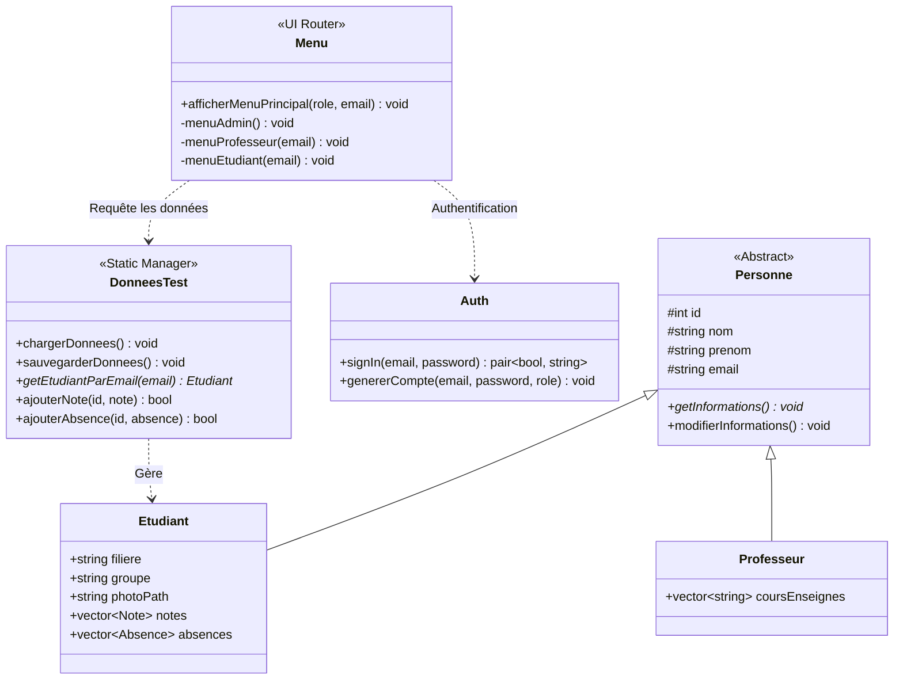

<div align="center">

# 🎓 School Management System 
### *Système Universitaire de Gestion Scolaire & Pédagogique en C++*

[](https://isocpp.org/)
[](https://github.com/)
[](https://www.codeblocks.org/)
[](https://github.com/)
[](LICENSE)

<p align="center">
  <b>Une solution console robuste, modulaire et orientée objet pour l'administration académique, le suivi pédagogique et la gestion des étudiants.</b>
</p>

[Aperçu](#-présentation-du-projet) •
[Fonctionnalités](#-fonctionnalités-par-rôle) •
[Architecture & POO](#-architecture-technique--poo) •
[Installation & Compilation](#-compilation--démarrage) •
[Auteurs](#-auteurs)

---

</div>

## 📖 Présentation du Projet

**School Management System (SMS)** est une application logicielle développée en **C++** moderne, conçue pour modéliser et gérer les flux de données au sein d'une structure éducative (écoles d'ingénieurs, universités, instituts).

Elle intègre un système d'authentification basé sur les rôles (**RBAC - Role-Based Access Control**) offrant des interfaces distinctes pour :
* 🛡️ **L'Administration** : Supervise l'ensemble du corps professoral, des cohortes, des cours et filières.
* 👨‍🏫 **Le Corps Professoral** : Suit les étudiants de ses matières, saisit les notes et contrôle les absences.
* 🎓 **Les Étudiants** : Consultent leur dossier individuel, notes, coefficients et justificatifs d'absence.

Toutes les données sont sérialisées et persistées localement dans des fichiers textes structurés (format type CSV), garantissant portabilité, légèreté et indépendance vis-à-vis d'un SGBD externe.

---


## 🚀 Fonctionnalités par Rôle

### 🛡️ 1. Espace Administrateur
L'administrateur dispose des privilèges complets de gestion de la structure universitaire :
* **Gestion des Étudiants** :
  * Inscription complète avec génération automatique d'ID, d'adresse email académique (`pnom@email.com`) et de mot de passe.
  * Modification des données personnelles (Nom, Prénom, Email, Filière, Groupe).
  * Déplacement / Réaffectation d'un étudiant vers un autre groupe ou une autre filière.
  * Affichage tabulaire formaté de l'ensemble des étudiants ou filtré par groupe.
* **Gestion des Professeurs** :
  * Recrutement / Enregistrement avec assignation obligatoire à un ou plusieurs cours existants.
  * Consultation des enseignants rattachés à chaque filière.
  * Décharge ou suppression d'un professeur d'un cours.
* **Gestion Académique (Filières, Groupes & Cours)** :
  * Création et administration des filières (ex. *IIR*, *GC*) et rattachement aux départements.
  * Découpage des promotions en groupes d'études (ex. *G1*, *G2*).
  * Définition des modules de cours (Code, Intitulé, Coefficient, Salle, Enseignant assigné).

### 👨‍🏫 2. Espace Professeur
Chaque enseignant n'a accès qu'au périmètre strict de ses cours et de ses étudiants :
* **Consultation Ciblée** : Visualisation détaillée des seuls étudiants inscrits aux cours dispensés.
* **Gestion des Évaluations (Notes)** :
  * Saisie de notes associées au code matière, à une appréciation textuelle et à la date d'examen.
  * Mise à jour / Rectification d'une note avec validation stricte de l'intervalle `[0 ; 20]`.
* **Suivi de l'Assiduité (Absences)** :
  * Enregistrement des absences horodatées.
  * Gestion du statut de justification (`Justifiée : Oui / Non`) et saisie du motif justificatif.

### 🎓 3. Espace Étudiant
L'étudiant dispose d'un tableau de bord individuel en lecture seule :
* **Dossier Personnel** : Consultation de ses coordonnées, identifiant unique, filière et groupe d'appartenance.
* **Relevé Pédagogique** : Liste détaillée des notes obtenues par matière avec coefficients et commentaires du professeur.
* **Bilan d'Assiduité** : Historique exhaustif de ses absences avec les matières concernées et la conformité des justificatifs.

---

## 🏛️ Architecture Technique & POO

Le projet applique les principes reconnus du génie logiciel et de la conception orientée objet en **C++** :



### Points Clés de l'Implémentation
1. **Polymorphisme & Abstraction** : La classe mère `Personne` encapsule l'identité commune (`id`, `nom`, `prenom`, `email`) et définit les méthodes virtuelles.
2. **Couche de Persistance Statique** : La classe `DonneesTest` centralise le cache mémoire (`std::vector`) et orchestre la lecture/écriture sur disques des 7 fichiers de données.
3. **Sécurité & Contrôle des Saisies** :
   * Validation d'adresses email via expressions régulières (`std::regex`).
   * Nettoyage des chaînes de caractères pour prévenir les corruptions de format délimité.
   * Traitement d'erreurs au moyen d'exceptions typées (`AuthException`, `std::runtime_error`).

---

## 🗂️ Organisation des Données

L'application stocke les informations dans des fichiers plats délimités par des virgules (CSV-like) :

<details>
<summary><b>📂 Cliquez pour déplier la spécification détaillée des fichiers</b></summary>

<br>

| Fichier Source | Description | Structure des Champs |
| :--- | :--- | :--- |
| `users.txt` | Comptes d'accès | `email,password,role` |
| `etudiants.txt` | Dossiers étudiants | `id,nom,prenom,email,filiere,groupe,photo` |
| `cours.txt` | Catalogue des cours | `code,nom,coefficient,salle,email_prof` |
| `notes.txt` | Évaluations | `etudiant_id,matiere,note,appreciation,date` |
| `absences.txt` | Registre des présences | `etudiant_id,matiere,date,justifiee,motif` |
| `filieres.txt` | Cursus & Départements | `nom,departement,cours1;cours2;...` |
| `groupes.txt` | Répartition des cohortes | `nom,filiere,id1;id2;...` |

</details>

---

## 🛠️ Compilation & Démarrage

### Prérequis
* Compilateur C++ supportant la norme **C++11** ou ultérieure (`g++` 4.8+, Clang, ou MSVC).
* Système d'exploitation : **Windows**, **Linux**, ou **macOS**.

### Option 1 : Via l'IDE Code::Blocks (Simple)
1. Ouvrez le fichier projet **`projet c++.cbp`** dans **Code::Blocks**.
2. Allez dans le menu **Build** > **Build and Run** (Raccourci : `F9`).

### Option 2 : En Ligne de Commande (Terminal / PowerShell / Bash)

1. **Cloner le projet** :
   ```bash
   git clone https://github.com/anasschenguiti/School-Management-System.git
   cd School-Management-System
   ```

2. **Compiler l'application** :
   ```bash
   g++ -std=c++11 main.cpp auth.cpp donnees.cpp menu.cpp personne.cpp -o sms.exe
   ```

3. **Exécuter** :
   ```bash
   # Sur Windows (PowerShell / Invite de commandes)
   .\sms.exe

   # Sur Linux / macOS
   ./sms.exe
   ```

---

## 🖥️ Aperçu de l'Interface Console

```text
=====================================================
            ACADEMIC MANAGEMENT SYSTEM
=====================================================

=== Authentication System ===
1. Sign In
2. Exit
Choice: 1

=== Sign In ===
Email: admin@email.com
Password: **********

Connexion reussie!
Role: admin

=== Menu Admin ===
1. Gestion des etudiants
2. Gestion des professeurs
3. Gestion des filieres
4. Gestion des groupes
5. Gestion des cours
6. Se deconnecter
Choix: _
```

---

## 🚀 Perspectives d'Évolution (Roadmap)

- [x] Authentification multi-rôles sécurisée (RBAC).
- [x] Persistance complète des notes, absences et relations académiques.
- [x] Validation des entrées utilisateur et gestion fine des exceptions.
- [ ] Migration de la persistance fichier vers une base relationnelle (**SQLite / PostgreSQL**).
- [ ] Interface graphique utilisateur (**Qt / wxWidgets**).
- [ ] Chiffrement et hachage des mots de passe (**bcrypt / SHA-256**).
- [ ] Exportation automatique des bulletins de notes au format **PDF**.

---

## 👥 Auteurs

Projet universitaire réalisé avec passion par :

* **Anas Chenguiti** - [@achenguiti](https://github.com/achenguiti)
* **Salaheddine Manaa** - [@salahmanaa](https://github.com/salahmanaa)


---

## 📄 Licence

Ce projet est distribué sous la licence **MIT**. Vous êtes libre de l'utiliser, l'étudier et l'adapter pour vos besoins académiques ou personnels.